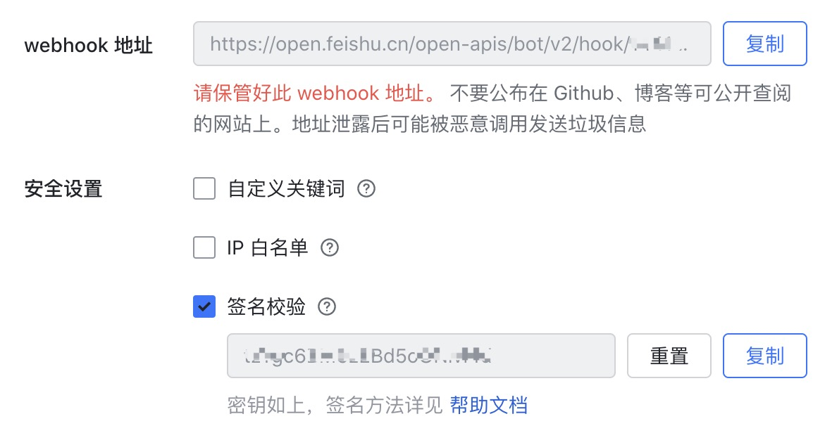

# arxiv-feishu-bot
We develop A simple feishu bot script daily pushes arxiv latest articles. His
 effect is as follows:
 

Of course, you can also use other online website to monitor the latest progress
 of  Arxiv such as https://deeplearn.org/ .
 
And our purpose of making this is to facilitate the discussion of the latest
  articles in Feishu, hope this script can be helpful to you.
  
Our code is mainly based on this 
[project](https://github.com/kobiso/get-daily-arxiv-noti) .

Next we mainly introduce how to use.

## How to use 

1. New a feishu bot and replace feishu webhook URL and secret in
 `src/config.py` 


2. pip install -r requirements.txt

3. (Option) Rewrite the function `filter_paper` in `src/spider.py` with your
 needs.
 
4. Set this script as planned work through `crontab` or other commands. 

```bash
30 10 * * * python3 $Absolute path$
```

And then you can see the news pushed at 10:30 every day.